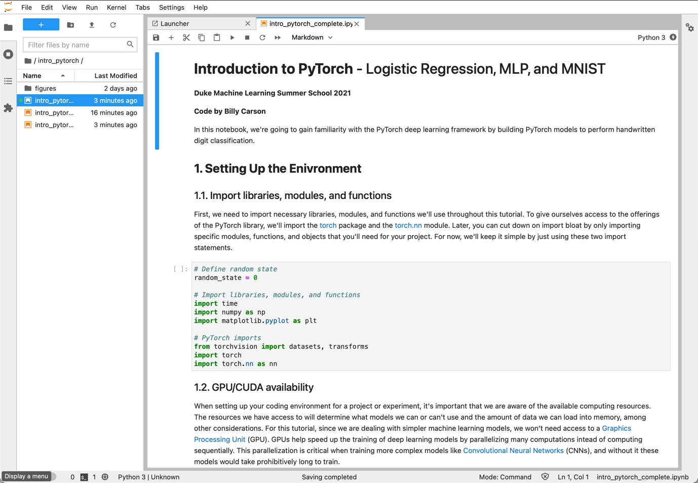

# PyTorch with JupyterLab Template for Duke ML Lab

This is a replica of the lab environment used in the Duke Machine Learning Virtual Summer School. The environmnet was adapted to use the latest [PyTorch](https://pytorch.org) image + installs [JupyterLab](https://jupyterlab.readthedocs.io/en/latest/) on it to allow easy work.

The workspace directory used by JupyterLab is mapped to ./workspace in this repo, so you have easy access to all your files.
**Note that some of the exercises were slightly adaptad to allow datasets download and support to torchtext.legacy**

## Install

Clone the repository: `git clone https://github.com/OneLastTry/pytorch-duke.git` and then execute from the main directory one of the commands below to perform the desired action:

- **build the image:** `docker-compose build`
- **start container:** `docker-compose up -d`
- **stop container:** `docker-compose stop`
- **reset container:** `docker-compose down`

## Access

With the container running you can access _JupyterLab_ using the link below:
[http://localhost:5000/lab](http://localhost:5000/lab)
The password is **admin**, you can change that on the _Dockerfile_.



## Helpul links

- [Install Docker](https://docs.docker.com/get-docker/)
- [Install docker-compose](https://docs.docker.com/compose/install/)

## Directory Structure

```bash
├── Dockerfile
├── LICENSE
├── README.md
├── docker-compose.yml
├── pytorch-duke.code-workspace
└── workspace
    ├── MLvSS_2021_Day2_Coding
    │   ├── Figures
    │   │   ├── chapel.jpg
    │   │   ├── conv_filters.png
    │   │   ├── maxpool.png
    │   │   ├── mnist_cnn_ex.png
    │   │   ├── mnist_digital.png
    │   │   └── mnist_matmul.png
    │   ├── Student_MLvSS2021_ImageAnalysis-clear.ipynb
    │   ├── Student_MLvSS2021_ImageAnalysis-complete.ipynb
    │   └── Student_MLvSS2021_ImageAnalysis.ipynb
    ├── Student_Pytorch_NLP_tutorial-clear.ipynb
    ├── Student_Pytorch_NLP_tutorial-complete.ipynb
    ├── Student_Pytorch_NLP_tutorial.ipynb
    └── intro_pytorch
        ├── figures
        │   ├── mnist_examples.png
        │   └── mnist_matmul.png
        ├── intro_pytorch-clean.ipynb
        ├── intro_pytorch.ipynb
        └── intro_pytorch_complete.ipynb

5 directories, 22 files
```
